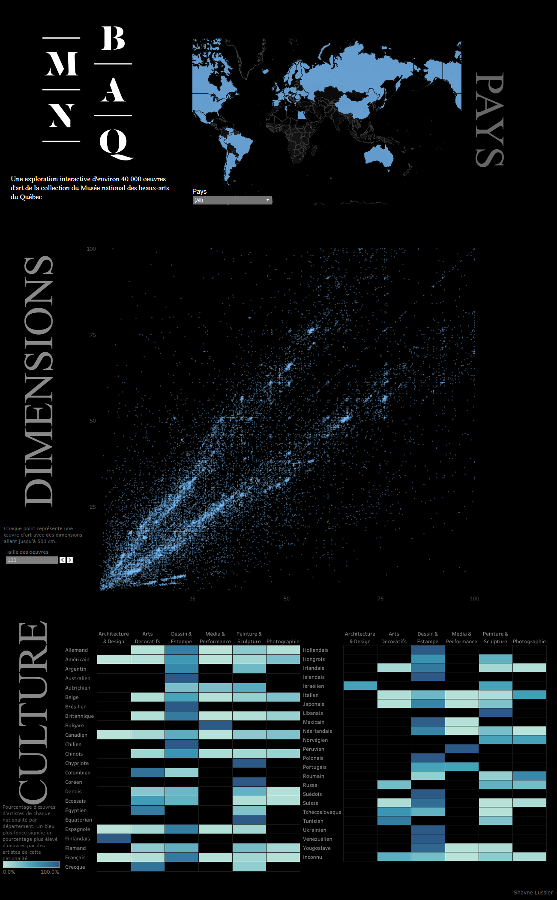

# MNBAQ
Commissioned dashboard for the Musée national des beaux-arts du Québec. The goal was to allow visitors to dynamically interact with the museum's database via tablet or mobile. User's could filter the catalogue to find additional information, directions and images about all included pieces.
 
Visit at: https://public.tableau.com/app/profile/shayne.lussier/viz/MNBAQCatalogue/Dashboard

